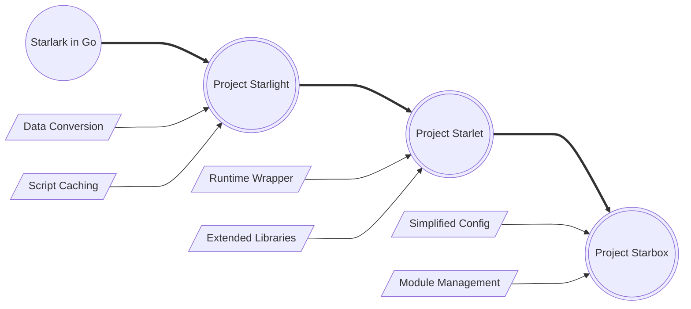

# Welcome to Project Star*!

Welcome to **Project Star\***, a sophisticated suite of projects designed to supercharge your experience with Starlark and Go. Building upon the robust foundation of [**Starlark in Go**](https://github.com/google/starlark-go), our projects aim to address and rectify common challenges associated with the integration and utilization of Starlark within Go applications.

**Project Star\*** consists of three main components: [**Starlight Enhanced**](https://github.com/1set/starlight), [**Starlet**](https://github.com/1set/starlet), and [**Starbox**](https://github.com/1set/starbox). Each serves a unique role in enhancing your Starlark experience with Go, providing solutions to data conversion, environment configuration, and library deficiency issues.

## Projects

The three projects that make up **Project Star\*** are designed to work together seamlessly or independently, depending on your needs. Here's a brief overview of each project:

- [**Starlight Enhanced**](https://github.com/1set/starlight) is a sophisticated fork of the Starlight project, which is a wrapper for Starlark in Go. It primarily addresses issues related to the conversion of data structures between Go and Starlark. The enhanced version incorporates bug fixes and additional functionalities that were absent in the original Starlight project, thereby ensuring compatibility with the latest versions of Starlark in Go.
- [**Starlet**](https://github.com/1set/starlet) builds upon the advancements made in Starlight Enhanced, providing a more comprehensive solution to data conversion issues. Besides, it introduces a more streamlined interface for the execution of Starlark scripts and enhances the functionality of Starlark by providing a rich set of third-party libraries. It also presents an alternative data conversion method.
- [**Starbox**](https://github.com/1set/starbox), the final piece of Project Star*, takes Starlet to the next level. It further simplifies the configuration of the Starlark's runtime environment and provides an even richer set of third-party libraries. The goal of Starbox is to make the integration of Starlark scripting into Go applications as effortless as possible, thereby boosting developer productivity and enhancing the usability of the application.

Each project has its unique strengths and focuses on different aspects of the Go-Starlark integration. Depending on the specific use case, one might be more suitable than the others.

| Project                | Go-Starlark Interoperability                                                                                                                                                                                          | Configuration & Environment                                                                                                                                                                                                                  | Standard & Third-party Libraries                                                                                                                                                                          |
|------------------------|-----------------------------------------------------------------------------------------------------------------------------------------------------------------------------------------------------------------------|----------------------------------------------------------------------------------------------------------------------------------------------------------------------------------------------------------------------------------------------|-----------------------------------------------------------------------------------------------------------------------------------------------------------------------------------------------------------|
| **Starlight Enhanced** | Offers robust support for seamless data conversion between Go and Starlark types through the `convert` package, including structs, slices, maps, and functions. However, Go channels and complexes are not supported. | Introduces an efficient caching mechanism to optimize script execution performance. Simplifies script execution through the `Eval` function that attempts to simplify the complexities of setting up and executing Starlark scripts.         | No specific third-party libraries extensions are provided.                                                                                                                                                |
| **Starlet**            | Uses the `convert` package from **Starlight** for data conversion and provides an optional `dataconv` package for transforming Go values into their Starlark equivalents and vice versa.                              | The `Machine` type serves as a comprehensive wrapper for Starlark runtime environments, offering an intuitive API for executing Starlark scripts, managing global variables, controlling script execution flow, and handling script outputs. | Includes a set of custom modules and libraries that extend the functionality of Starlark. These include file manipulation, HTTP client, JSON/CSV handling, and time, math modules from the official repo. |
| **Starbox**            | Facilitates robust and smooth data exchange between Go and Starlark, enhancing interoperability and simplifying the integration process. Supports calling Go functions from Starlark and vice versa.                  | The `Starbox` type offers a streamlined interface for executing Starlark scripts and managing interactive REPL sessions. Introduces a shared memory concept to enable data sharing across different script executions and instances.         | Comes with a suite of built-in functions and the ability to load custom and override existing modules, modules from **Starlet** are organized into *Module Set* based on functionality and permissions.   |

## Interconnected Solutions

These projects are interconnected, each building upon the foundation laid by its predecessors to provide a comprehensive solution for integrating Starlark into Go applications on various levels. Here's how they fit together:

- [**Starlight Enhanced**](https://github.com/1set/starlight) addresses the core challenge of data conversion and function calls between Go and Starlark, setting the stage for more advanced integrations.
- [**Starlet**](https://github.com/1set/starlet) takes the capabilities of Starlight Enhanced further by adding more libraries, enhancing data conversion options, and simplifying the script execution environment.
- [**Starbox**](https://github.com/1set/starbox) encapsulates the features of both Starlight Enhanced and Starlet, simplifying runtime configuration and module management, and providing tools for a richer scripting experience in production environments.

Together, **Project Star\*** aims to make Starlark scripting in Go applications as seamless and powerful as possible.

The following diagram illustrates the relationship and progression between the three projects:

## Getting Started

To get started with any of the Project Star* components, check out their respective sections on our documentation site. Each project offers installation instructions, usage examples, and detailed feature descriptions to help you integrate Starlark scripting into your Go projects effectively.

Whether you're looking to fine-tune data conversion between Go and Starlark, configure the scripting environment to your needs, or extend Starlark with powerful libraries, Project Star* has a solution for you.

We welcome contributions and feedback on all aspects of Project Star*. Your input helps us improve and evolve these projects to better meet the needs of the Go and Starlark developer communities.

