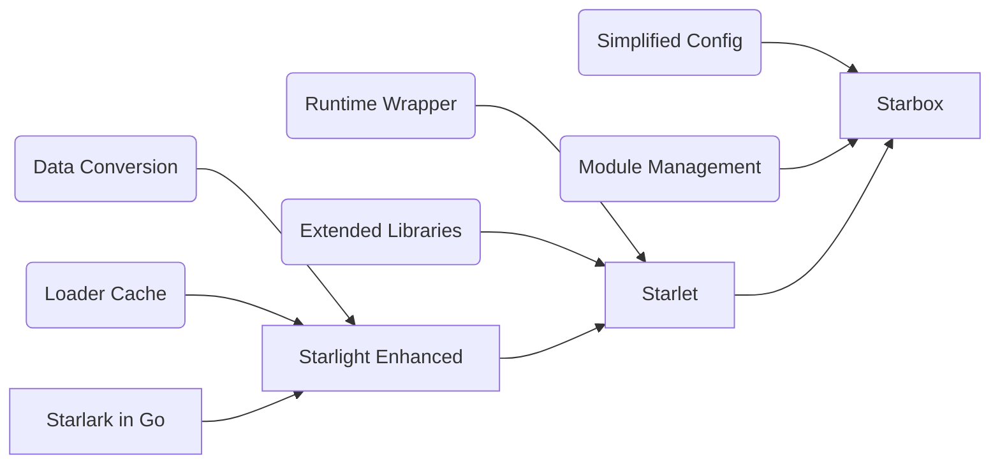

# Welcome to Project Star*!

Welcome to Project Star*, a sophisticated suite of projects designed to supercharge your experience with Starlark in Go. Building upon the robust foundation of Starlark in Go, our projects aim to address and rectify common challenges associated with the integration and utilization of Starlark within Go applications.

Project Star* consists of three main components: **Starlight Enhanced**, **Starlet**, and **Starbox**. Each serves a unique role in enhancing your Starlark experience with Go, providing solutions to data conversion, environment configuration, and library deficiency issues.

## Projects Overview

| Project | Description |
|:-------:|:-----------:|
| [Starlight Enhanced](https://github.com/1set/starlight) | An enhanced fork of the original Starlight project, focusing on facilitating smoother data conversion between Go and Starlark. |
| [Starlet](https://github.com/1set/starlet) | Builds upon Starlight Enhanced, providing a user-friendly and powerful wrapper around Starlark in Go, and offering an enriched set of third-party libraries for Starlark. |
| [Starbox](https://github.com/1set/starbox) | Based on Starlet, Starbox simplifies the configuration of Starlark's runtime environment and further enriches the set of third-party libraries, making the integration of Starlark into Go applications as seamless as possible. |

Here's a diagram to illustrate the relationship and progression between the three projects:

## Projects in Detail

### Starlight Enhanced

Starlight Enhanced is our proprietary version of the Starlight project, which is a wrapper for Starlark in Go. It primarily addresses issues related to the conversion of data structures between Go and Starlark. The enhanced version incorporates bug fixes and additional functionalities that were absent in the original Starlight project, thereby ensuring compatibility with the latest versions of Starlark in Go.

### Starlet

Starlet builds upon the advancements made in Starlight Enhanced, providing a more comprehensive solution to data conversion issues. Besides, it introduces a more streamlined interface for the execution of Starlark scripts and enhances the functionality of Starlark by providing a rich set of third-party libraries. It also presents an alternative data conversion method.

### Starbox

Starbox, the final piece of Project Star*, takes Starlet to the next level. It further simplifies the configuration of the Starlark's runtime environment and provides an even richer set of third-party libraries. The goal of Starbox is to make the integration of Starlark scripting into Go applications as effortless as possible, thereby boosting developer productivity and enhancing the usability of the application.

## Conclusion

In conclusion, Project Star* provides a comprehensive suite of solutions designed to enhance your experience with Starlark in Go. Whether you're looking for a simple data conversion tool, an enriched set of libraries, or a seamless integration experience, Project Star* has got you covered. Feel free to explore each project's documentation to learn more about how they can contribute to your Starlark journey.
