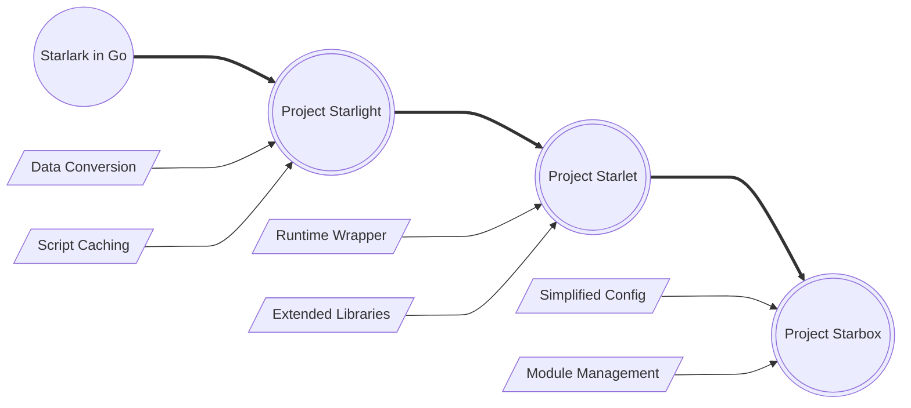

# Welcome to Project Star*!

Welcome to **Project Star\***, a sophisticated suite of projects designed to supercharge your experience with Starlark and Go. Building upon the robust foundation of **Starlark in Go**, our projects aim to address and rectify common challenges associated with the integration and utilization of Starlark within Go applications.

**Project Star\*** consists of three main components: **Starlight Enhanced**, **Starlet**, and **Starbox**. Each serves a unique role in enhancing your Starlark experience with Go, providing solutions to data conversion, environment configuration, and library deficiency issues.

## Projects

The three projects that make up **Project Star\*** are designed to work together seamlessly or independently, depending on your needs. Here's a brief overview of each project:

| Project            | Description                                                                                                                 | Key Features                                                                        |
|--------------------|-----------------------------------------------------------------------------------------------------------------------------|-------------------------------------------------------------------------------------|
| Starlight Enhanced | A sophisticated fork of the original Starlight project, focusing on seamless data conversion between Go and Starlark.       | Seamless data conversion  Script caching                                        |
| Starlet            | Builds upon Starlight Enhanced to offer an easier-to-use Go wrapper, flexible data conversion, and additional libraries.    | Flexible runtime abstraction  Extended libraries   Enhanced data conversion |
| Starbox            | Further simplifies script execution setup, introduces efficient data exchange, and extends Starlark with more capabilities. | Streamlined script execution  Module management  Integrated HTTP context    |

### Starlight Enhanced

Starlight Enhanced is our proprietary version of the Starlight project, which is a wrapper for Starlark in Go. It primarily addresses issues related to the conversion of data structures between Go and Starlark. The enhanced version incorporates bug fixes and additional functionalities that were absent in the original Starlight project, thereby ensuring compatibility with the latest versions of Starlark in Go.

### Starlet

Starlet builds upon the advancements made in Starlight Enhanced, providing a more comprehensive solution to data conversion issues. Besides, it introduces a more streamlined interface for the execution of Starlark scripts and enhances the functionality of Starlark by providing a rich set of third-party libraries. It also presents an alternative data conversion method.

### Starbox

Starbox, the final piece of Project Star*, takes Starlet to the next level. It further simplifies the configuration of the Starlark's runtime environment and provides an even richer set of third-party libraries. The goal of Starbox is to make the integration of Starlark scripting into Go applications as effortless as possible, thereby boosting developer productivity and enhancing the usability of the application.

## Interconnected Solutions

These projects are interconnected, each building upon the foundation laid by its predecessors to provide a comprehensive solution for integrating Starlark into Go applications on various levels. Here's how they fit together:

- **Starlight Enhanced** addresses the core challenge of data conversion and function calls between Go and Starlark, setting the stage for more advanced integrations.
- **Starlet** takes the capabilities of Starlight Enhanced further by adding more libraries, enhancing data conversion options, and simplifying the script execution environment.
- **Starbox** encapsulates the features of both Starlight Enhanced and Starlet, simplifying runtime configuration and module management, and providing tools for a richer scripting experience in production environments.

Together, **Project Star\*** aims to make Starlark scripting in Go applications as seamless and powerful as possible.

The following diagram illustrates the relationship and progression between the three projects:

## Getting Started

To get started with any of the Project Star* components, check out their respective sections in this documentation. Each project offers installation instructions, usage examples, and detailed feature descriptions to help you integrate Starlark scripting into your Go projects effectively.

Whether you're looking to fine-tune data conversion between Go and Starlark, configure the scripting environment to your needs, or extend Starlark with powerful libraries, Project Star* has a solution for you.

We welcome contributions and feedback on all aspects of Project Star*. Your input helps us improve and evolve these projects to better meet the needs of the Go and Starlark developer communities.
